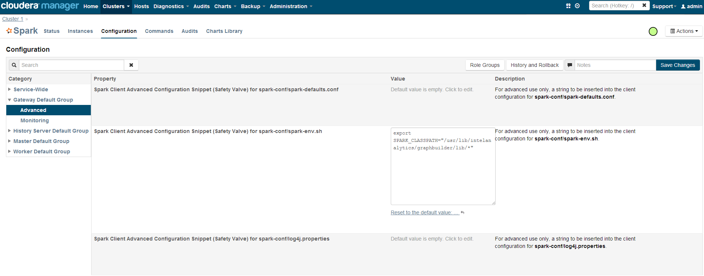

====================================
Intel Analytics Package Installation
====================================

.. contents::
    :local:
    
------------
Introduction
------------

In this guide we will walk through the Intel Analytics installation and the minimal configuration needed to get the service running.
This guide is not going to walk you through the Cloudera cluster installation since that subject is covered by Cloudera in greater detail.

See `Cloudera Installation Documentation <http://www.cloudera.com/content/cloudera-content/cloudera-docs/CM5/latest/Cloudera-Manager-Installation-Guide/cm5ig_install_cm_cdh.html>`_

------------
Requirements
------------

1. RHEL/Centos 6.4 OS
#. Sudo access is required to install the various Intel Analytics packages since they are installed through Yum and for the editing of root owned configuration files
#. Cloudera cluster with CDH-5.0.2-p0.13 or CDH-5.0.3-p0.35 with the following services installed and running.

    a. HDFS
    #. SPARK
    #. Hbase
    #. Yarn(MR2)
    #. Zookeeper

#. Python 2.6 - RHEL/Centos 6.4 ships with python 2.6
#. `EPEL yum repository <https://fedoraproject.org/wiki/EPEL>`_ -- All the nodes on the cluster must have the EPEL yum repository.
   Adding the EPEL repository is straight forward and can be accomplished with a few simple steps.
#. Intel Analytics Private Repository Access - if you have not been given AWS access and secret keys you will not be able to install Intel Analytics.

------------------------
Intel Analytics packages
------------------------

The dependency list is merely informational. When yum installs a package, it will pull dependencies automatically. All the Cloudera dependencies are implied for all packages.

Intel Analytics Rest Server
===========================
Package Name: intelanalytics-rest-server

Dependencies

*   intelanalytics-python-client
*   intelanalytics-graphbuilder
*   python-cm-api
*   python-argparse
*   Java Runtime Environment or Java Development Environment 1.7

Intel Analytics Python Client
=============================
Needs to be installed on every spark worker node as well as the gateway node or other machine that is going to be the designated client.
The IA python client submitting requests, the rest server and the rest client package installed on the worker nodes must all be the same version.

Package Name: intelanalytics-python-rest-client

Dependencies

*   python 2.6
*   `python-ordereddict <https://pypi.python.org/pypi/ordereddict>`_
*   `numpy <https://pypi.python.org/pypi/numpy>`_ >= 1.8.1
*   `python-bottle <https://pypi.python.org/pypi/bottle>`_ >= 0.12
*   `python-requests <https://pypi.python.org/pypi/requests>`_ >= 2.2.1

.. ifconfig:: internal_docs

    ------------------- --------------------------- --------------------------- -------------------------
    Component           Current IAT Version         CDH Version (5.1.0)         Python Version Compatible
    =================== =========================== =========================== =========================
    Hadoop              1.2.1                       2.3.0
    HBase               0.94.12                     0.98.1
    Yarn                --                          2.3.0
    ZooKeeper           --                          3.4.5
    Python              2.6 + 2.7                   2.6 + 2.7
    Spark               1.0	                        1.0.0
    Giraph              1.1.0-SNAPSHOT (96968fd)    1.1.0-SNAPSHOT (96968fd)
    Titan               0.5m1
    Faunus              0.5m1
    JDK                 1.7                         1.7

    Python Modules
    HappyBase           0.7                                                     2.6 + 2.7
    SciPy               0.13.2                                                  2.6 + 2.7
    NumPy               1.8.0                                                   2.6 + 2.7

    sympy               0.7.4.1
    nltk                2.0.4
    Jinja2              2.7.2
    tornado             3.2
    mrjob               0.4.2
    matplotlib          1.3.1
    pandas              0.12.0
    pyzmq               14.0.1
    pyjavaproperties    0.6
    mock                1.0.1
    nose                1.3.0
    coverage            3.7.1
    pydoop              0.11.1
    virtualenv          1.10.1
    interval            1.0.0
    ------------------- --------------------------- --------------------------- -------------------------

Intel Analytics Graph Builder
=============================
Needs to be installed with the IA rest server

Package Name: intelanalytics-graphbuilder

Dependencies

*   intelanalytics-spark-deps

Intel Analytics Spark Dependencies
==================================
Needs to be installed on every individual spark worker node.

package name: intelanalytics-spark-deps

Dependencies

*   none

------------
Installation
------------

Adding Extra Repositories
=========================

The first step in the installation is adding EPEL, and two Intel Analytics repositories to make the `YUM <http://en.wikipedia.org/wiki/Yellowdog_Updater,_Modified>`_ installation possible.
The EPEL, and Intel Analytics repositories must be installed on all spark master, and worker nodes as well as the node that will be running the Intel Analytics rest server.

Add EPEL Repository
-------------------
Before trying to install the EPEL repo run the following command to see if it's already available on the machines you will be installing Intel Analytics on.
::

    sudo yum repolist

    #sample output
    repo id                                    repo name
    cloudera-cdh5                              Cloudera CDH, Version 5                                              141
    cloudera-manager                           Cloudera Manager, Version 5.1.0                                        7
    epel                                       Extra Packages for Enterprise Linux 6 - x86_64                    11,022
    rhui-REGION-client-config-server-6         Red Hat Update Infrastructure 2.0 Client Configuration Server 6        2
    rhui-REGION-rhel-server-releases           Red Hat Enterprise Linux Server 6 (RPMs)                          12,690
    rhui-REGION-rhel-server-releases-optional  Red Hat Enterprise Linux Server 6 Optional (RPMs)                  7,168

You want to look for "epel" repo id.

If the EPEL repository is missing run these commands to install the necessary files.
::

    wget http://download.fedoraproject.org/pub/epel/6/x86_64/epel-release-6-8.noarch.rpm
    sudo rpm -ivh epel-release-6-8.noarch.rpm

To verify the installation run
::

    sudo yum repolist

    #sample output
    repo id                                                                         repo name
    epel                                                                            Extra Packages for Enterprise Linux 6 - x86_64                                                         11,018
    rhui-REGION-client-config-server-6                                              Red Hat Update Infrastructure 2.0 Client Configuration Server 6                                             2
    rhui-REGION-rhel-server-releases                                                Red Hat Enterprise Linux Server 6 (RPMs)                                                               12,663
    rhui-REGION-rhel-server-releases-optional    
                                           
Make sure the "epel" repo id is present.

Add Intel Analytics Dependency Repository
-----------------------------------------

We pre-package and host some open source libraries to aid with installations.
In some cases we pre-packaged newer versions from what is available in RHEL or EPEL repositories.

To add the dependency repository run the following command::

    wget https://intel-analytics-dependencies.s3-us-west-2.amazonaws.com/Intel Analytics-deps.repo
    sudo cp Intel Analytics-deps.repo /etc/yum.repos.d/

If you have issues running the above command, try entering the following, being careful about the placement of the ``"`` characters::

    sudo touch /etc/yum.repos.d/Intel Analytics-deps.repo
    echo "[intel-analytics-deps]
    name=intel-analytics-deps
    baseurl=https://intel-analytics-dependencies.s3-us-west-2.amazonaws.com/yum
    gpgcheck=0
    priority=1 enabled=1"  | sudo tee -a /etc/yum.repos.d/Intel Analytics-deps.repo

To test the installation of the dependencies repository run the following command::

    sudo yum info yum-s3

    #should print something close to this
    Available Packages
    Name        : yum-s3
    Arch        : noarch
    Version     : 0.2.4
    Release     : 1
    Size        : 9.0 k
    Repo        : intel-analytics-deps
    Summary     : Amazon S3 plugin for yum.
    URL         : git@github.com:NumberFour/yum-s3-plugin.git
    License     : Apache License 2.0

If you get similar output, install yum-s3 package::

    sudo yum -y install yum-s3

Add Intel Analytics Private Repository
--------------------------------------

Next we will create /etc/yum.repos.d/ia.repo.
Don't forget to replace ``YOUR_KEY``, and ``YOUR_SECRET`` with your given AWS access, and secret keys.
Run the following command to create ``/etc/yum.repos.d/ia.repo`` file.
::

    echo "[intel-analytics]
    name=intel analytics
    baseurl=https://intel-analytics-repo.s3-us-west-2.amazonaws.com/release/latest/yum/dists/rhel/6
    gpgcheck=0
    priority=1
    s3_enabled=1
    #yum-get iam only has get
    key_id=YOUR_KEY
    secret_key=YOUR_SECRET" | sudo tee -a /etc/yum.repos.d/Intel Analytics.repo

.. Note::

    **Don't forget to replace YOUR_KEY, and YOUR_SECRET with the keys that were given to you.**

Verify the installation of the Intel Analytics repository by running::

    sudo yum info intelanalytics-rest-server

    #sample output
    Available Packages
    Name        : intelanalytics-rest-server
    Arch        : x86_64
    Version     : 0.8
    Release     : 1474
    Size        : 419 M
    Repo        : intel-analytics
    Summary     : intelanalytics-rest-server-0.8 Build number: 1474. TimeStamp 20140722211530Z
    URL         : graphtrial.intel.com
    License     : Confidential

If you get package details for intelanalytics-rest-server package, then the repository installed correctly and you can continue installation.

Troubleshooting Private Repository
~~~~~~~~~~~~~~~~~~~~~~~~~~~~~~~~~~
The most common error when using the private repository is in correct access and secret keys or the server time is out of sync with the world.
It never hurts to double check your access and secret keys in the ia.repo file.

To keep your system time in sync with the world run::

    sudo service ntpd start

Installing Intel Analytics Packages
===================================

Installing Intel Analytics Rest Server
--------------------------------------
This next step is going to install IA rest server and all it's dependencies.
Only one instance of the rest server needs to be installed. Although it doesn't matter where it's installed it's usually installed along side the HDFS name node.
::

    sudo yum -y install intelanalytics-rest-server

Installing Intel Analytics Spark Dependencies
---------------------------------------------
The Intel Analytics spark dependencies package needs to be installed on every node running the spark worker role.
::

    sudo yum -y install intelanalytics-spark-deps

Installing Intel Analytics Python Rest Client
---------------------------------------------
The Intel Analytics python rest client package needs to be installed on every node running the spark worker role.
::

    sudo yum -y install intelanalytics-python-rest-client

Alternate Intel Analytics Spark Dependencies, and Python Rest Client Installation Command
-----------------------------------------------------------------------------------------
You still need to run this command on every spark worker node but you can combine both the spark dependencies and python rest client installation into one command.
::

    sudo yum -y install intelanalytics-spark-deps intelanalytics-python-rest-client

-------------
Configuration
-------------

There are two config files you may need to edit on the node that has the Intel Analytics rest server package.

*   **/etc/default/intelanalytics-rest-server** - Configuration file for the Intel Analytics linux service
*   **/etc/intelanalytics/rest-server/application.conf** - Configuration file for the Intel Analytics rest server application

**/etc/default/intelanalytics-rest-server**:

If your Cloudera cluster is parcel based you can skip this step because we default to parcel based clusters.
If your cluster is not parcel based  you need to update the SPARK_HOME value to the location where Cloudera installed Spark.
Usually non-parcel installations of Cloudera will install Spark to /usr/lib/spark.

/etc/default/intelanalytics-rest-server::

    #intelanalytics-rest-server env file
    #Set all your environment variables needed for the rest server here

    # depending on the CDH install method used, set the appropriate SPARK_HOME below:

    #RPM cloudera installations will place Spark in /usr/lib/spark
    #export SPARK_HOME="/usr/lib/spark"

    #Parcel Cloudera installations will place Spark in /opt/cloudera/parcels/CDH/lib/spark
    #/opt/cloudera/parcels/CDH will be a symlink to your current Cloudera version
    export SPARK_HOME="/opt/cloudera/parcels/CDH/lib/spark"

    export IA_JVM_OPT="-XX:MaxPermSize=256m"

    export IAUSER="iauser"
    export HOSTNAME=`hostname`

/etc/intelanalytics/rest-server/application.conf.tpl
====================================================

The application.conf.tpl is only a reference configuration file.
This file needs to be copied and renamed to application.conf then updated before the Intel Analytics rest server is started.

/etc/intelanalytics/rest-server/application.conf
================================================

Configuration Script
--------------------

The configuration of application.conf is semi automated via the use of a python script in /etc/intelanalytics/rest-sever/config.py.
It will query Cloudera manager for the necessary configuration values and create a new application.conf based off the application.conf.tpl.

To configure your spark service and your Intel Analytics installation do the following::

    cd /etc/intelanalytics/rest-sever/
    sudo python config.py

After executing the script answer the prompts to configure your cluster.

Sample output with notes::

    #if the default is correct hit enter
    What port is Cloudera manager listening on? defaults to '7180' if nothing is entered:
    What is the Cloudera manager username? defaults to 'admin' if nothing is entered:
    What is the Cloudera manager password? defaults to 'admin' if nothing is entered:

    #if your cloudera manager instance only manages a single cluster this prompt will not come up
    1: Cluster Name: cluster 1            Version: CDH5
    2: Cluster Name: cluster 2            Version: CDH5
    Enter the clusters index number: 1
    You picked cluster 1

    No current SPARK_CLASSPATH set.
    Setting to:
    export SPARK_CLASSPATH="/usr/lib/intelanalytics/graphbuilder/lib/*"
    Deploying config   .   .   .   .   .   .   .   .   .   .   .   .  
    You need to restart Spark service for the config changes to take affect.

    #restarting the cluster is up to the user just in case Spark is busy running any jobs
    would you like to restart now? defaults to 'no' if nothing is entered: yes
    Restarting Spark  .   .   .   .   .   .   .   .   .   .   .   .   .   .   .   .   

    #Creating the /etc/intelanalytics/rest-server/application.conf file
    Creating application.conf file from application.conf.tpl
    Reading application.conf.tpl
    Updating configuration
    Writing application.conf

If you accidentally enter the wrong information on any of the prompts you can always run the script again.
It will use a fresh application.conf.tpl and query Cloudera manager again to recreate the application.conf file.

.. versionadded:: 0.8.5
    Server configuration can be directly accessed through the IA Toolkit:

        >>> ia.server.host = "myhostname"
        >>> ia.server.port = None
        >>> ia.server.ping()
        >>> ia.server.reset()   # restore server config to defaults in rest/config.py

You can now skip to Finish Intel Analytics Installation (TBD).

Manual Configuration
--------------------
 *This section is optional and only if additional changes to the configuration file are needed*
 
The rest-server package only provides a configuration template called application.conf.tpl.
We need to copy and rename this file to application.conf and update host names and memory configurations.
First let's copy and rename the file ::

    sudo cp /etc/intelanalytics/rest-server/application.conf.tpl
        /etc/intelanalytics/rest-server/application.conf

Note:
The above command has been split for enhanced readability in some medias.
It should be entered as a single line.

Open the file with your editor of choice::

    sudo vi /etc/intelanalytics/rest-server/application.conf

All the changes that need to be made are at the top of the file.
This is the section you want to look at::

    # BEGIN REQUIRED SETTINGS

    intel.analytics {

        # The host name for the Postgresql database in which the metadata will be stored
        //metastore.connection-postgresql.host = "invalid-postgresql-host"
        # This allows the use of an in memory data store. Restarting the rest server will create a fresh database and any 
        # data in the h2 DB will be lost 
        metastore.connection = ${intel.analytics.metastore.connection-h2} 

        engine {

            # The hdfs URL where the intelanalytics folder will be created
            # and which will be used as the starting point for any relative URLs
            fs.root = "hdfs://invalid-fsroot-host/user/iauser"

            # The (comma separated, no spaces) Zookeeper hosts that comma separated list of host names with zookeeper role assigned
            titan.load.storage.hostname = "invalid-titan-host"
            # Zookeeper client port, defaults to 2181
            //titan.load.storage.port = "2181"
        
            # The URL for connecting to the Spark master server
            spark.master = "spark://invalid-spark-master:7077"
            spark.conf.properties {
                # Memory should be same or lower than what is listed as available
                # in Cloudera Manager.
                # Values should generally be in gigabytes, e.g. "8g"
                spark.executor.memory = "invalid executor memory"
            }
        }
    }

    # END REQUIRED SETTINGS

Configure File System Root
~~~~~~~~~~~~~~~~~~~~~~~~~~

    In the following line the text "invalid-fsroot-host" should be replaced with the fully qualified domain of your HDFS installation::

        fs.root = "hdfs://invalid-fsroot-host/user/iauser"
        
    Example::

        fs.root = "hdfs://localhost.localdomain/user/iauser" 

If your Name Node port is not 8020 you can specify it after the host name::

    fs.root = "hdfs://localhost.localdomain:8020/user/iauser"

Configure Zookeeper Host
~~~~~~~~~~~~~~~~~~~~~~~~

    In the following line replace "invalid-titan-host" with the comma delimited list of fully qualified domain names of all nodes running the zookeeper service::

        titan.load.storage.hostname = "invalid-titan-host"

    Example::

        titan.load.storage.hostname = "localhost.localdomain" 

If your zookeeper client port is not 2181 un-comment the following line and replace 2181 with your zookeeper client port::

    titan.load.storage.port = "my zookeeper client port"

Configure Spark Master Host
~~~~~~~~~~~~~~~~~~~~~~~~~~~

    Update "invalid-spark-master" with the fully qualified domain name of the Spark master node::

        master = "spark://localhost.localdomain:7077"
    
    Example::

        master = "spark://localhost.localdomain:7077" 

Configure Spark Executor Memory
~~~~~~~~~~~~~~~~~~~~~~~~~~~~~~~

    The Spark executor memory needs to be set equal to or less than what is configured in Cloudera Manager.
    The Cloudera Spark installation will, by default, set the Spark executor memory to 8g, so 8g is usually a safe setting.
    If have any doubts you can always verify the executor memory in Cloudera manager.
    ::

        spark.executor.memory = "invalid executor memory"

    Example::

        spark.executor.memory = "8g"

    Click on the Spark service then configuration in Cloudera Manager to get executor memory.

    .. image:: ad_inst_IA_1.png
        :align: center

Set the Bind IP Address (Optional)
~~~~~~~~~~~~~~~~~~~~~~~~~~~~~~~~~~

    If you would like the Intel Analytics server to bind to all ip address and not just localhost update the following lines and follow the commented instructions.
    This configuration section is also near the top of the file.
    ::

        #bind address - change to 0.0.0.0 to listen on all interfaces
        //host = "127.0.0.1"

Updating the Spark Class Path
~~~~~~~~~~~~~~~~~~~~~~~~~~~~~

Run the following command to set the Spark class path::

    /usr/lib/intelanalytics/graphbuilder/set-cm-spark-classpath.sh
    
Follow the prompts and make corrections where necessary.

If you have problems running the script you can update the Spark class path through Cloudera manager.
If you log into Cloudera manager under the Spark configuration you can find the spark-conf/spark-env.sh setting.
If it isn't already set, add::

    export SPARK_CLASSPATH="/usr/lib/intelanalytics/graphbuilder/lib/*"
    
then restart the Spark service.

-------------------------------------------
Starting Intel Analytics Spark Dependencies
-------------------------------------------

After setting up the Intel Analytics repositories, run the following command on every host with a Spark worker::

    sudo yum -y install intelanalytics-spark-deps

Installing Intel Analytics Python Rest Client
=============================================

After setting up the Intel Analytics repositories, run the following command on every host with a Spark worker::

    sudo yum -y install intelanalytics-python-rest-client

After installing Intel Analytics Spark deps and Intel Analytics python rest client, you can start the rest server and start submitting requests.

Starting Intel Analytics Rest Server
====================================

Starting the Rest server is very easy.
It can be started like any other linux service.
::

    sudo service intelanalytics start

After starting the rest server, you can browse to the host on port 9099 to see if the server started successfully.

Troubleshooting
===============

The log files get written to /var/log/intelanalytics/rest-server/output.log or /var/log/intelanalytics/rest-server/application.log.
If you are having issues starting or running jobs, tail either log to see what error is getting reported while running the task::

    sudo tail -f /var/log/intelanalytics/rest-server/output.log

or::

    sudo tail -f /var/log/intelanalytics/rest-server/application.log

More details about the logs can be found here: :doc:`ad_log`.

.. toctree::
    :hidden:
    
    ad_log
