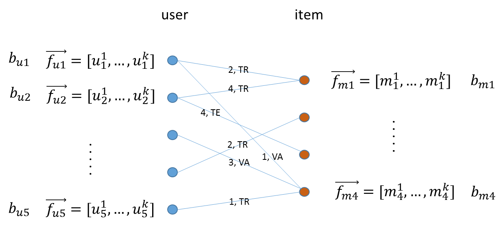

-----------------------
Collaborative Filtering
-----------------------

Collaborative filtering is a technique that is widely used in recommendation systems to suggest items (for example, products, movies,
articles) to potential users based on historical records of items that users have purchased, rated, or viewed.
The Intel Analytics Toolkit provides two different implementations of collaborative filtering, which differ only in their optimization method,
either Alternative Least Squares (ALS) or Conjugate Gradient Descent (CGD).
Both methods optimize the cost function found in Y. Koren,
`Factorization Meets the Neighborhood\: a Multifaceted Collaborative Filtering Model`_
in ACM KDD 2008.
For more information on optimizing using ALS see, Y. Zhou, D. Wilkinson, R. Schreiber and R. Pan,
`Large-Scale Parallel Collaborative Filtering for the Netflix Prize`_ , 2008.
CGD provides a faster, more approximate optimization of the cost function and should be used when memory is a constraint.

A typical representation of the preference matrix P in Giraph is a bi-partite graph, where nodes at the left side represent a list of
users and nodes at the right side represent a set of items (for example, movies), and edges encode the rating a user provided to an item.
To support training, validation and test, a common practice in machine learning, each edge is also annotated by “TR”, “VA” or “TE”.  

Each node in the graph will be associated with a vector :math:`\textstyle \overrightarrow {f_x}` of length :math:`k`, where :math:`k`
is the feature dimension specified by the user, and a bias term :math:`b_x`.
The predictions for item :math:`m_{j}`, from user :math:`u_{i}` care given by dot product of the feature vector and the user vector,
plus the item and user bias terms:

.. math::

    r_{ij} = \overrightarrow {f_{ui}} \cdot \overrightarrow {f_{mj}} + b_{ui} + b_{mj}

The parameters of the above equation are chosen to minimize the regularized mean squared error between known and predicted ratings:

.. math::

    cost = \frac {\sum error^2} {n} + \lambda * \left( bias^2 + \sum f_k^2 \right)

How this optimization is accomplished depends on whether the use uses the ALS or CGD functions respectively.
It is recommended that the ALS method be used to solve collaborative filtering problems.
The CGD method uses less memory than ALS, but it returns an approximate solution to the objective function and 
should only be used in cases when memory required for ALS is prohibitively high.

-------------------------------------------------------------------
Using ALS Optimization to Solve the Collaborative Filtering Problem
-------------------------------------------------------------------

ALS optimizes :math:`\overrightarrow f_{\*}` and :math:`b_{\*}` alternatively between user profiles using least squares on users and on items.
In the first iteration, the first feature of each item is set to its average rating and the others are set to small random numbers.
The algorithm then treats the :math:`m`’s as constant and optimizes :math:`u_{i}^{1},…,u_{i}^{k}` for each user, :math:`i`.
For an individual user, this is a simple ordinary least squares optimization over the items that that use has ranked.
Next, the algorithm takes the :math:`u`’s as constant and optimizes the :math:`m_{j}^{1},…,m_{j}^{k}` for each item, :math:`j`.
This is again an ordinary least squares optimization predicting the user rating of person that has ranked item :math:`j`.

At each step, the bias is computed for either items of users and the objective function shown below is evaluated.
The bias term for an item or user, computed for use in the next iteration is given by:

.. math::

    b = \frac{\sum error}{(1+\lambda)*n}

The optimization is said to converge if the change in the objective function is less than the convergence_threshold parameter or
the algorithm hits the maximum number of super steps. 

.. math::

    cost = \frac {\sum error^{2}}{n}+\lambda*\left(bias^{2}+\sum f_{k}^{2} \right)

Note that the equations above omit user and item subscripts for generality.
The :math:`l_{2}` regularization term, lambda, tries to avoid overfitting by penalizing the magnitudes of the parameters,
and :math:`\lambda` is a tradeoff parameter that balances the two terms and is usually determined by cross validation (CV).

After the parameters :math:`\overrightarrow f_{*}` and :math:`b_{\*}` are determined, given an item :math:`m_{j}`
the rating from user :math:`u_{i}` can be predicted by the simple linear model:

.. math::

    r_{ij} = \overrightarrow {f_{ui}} \cdot \overrightarrow {f_{mj}} + b_{ui} + b_{mj}

.. _Factorization Meets the Neighborhood\: a Multifaceted Collaborative Filtering Model: http://public.research.att.com/~volinsky/netflix/kdd08koren.pdf
.. _Large-Scale Parallel Collaborative Filtering for the Netflix Prize: http://citeseerx.ist.psu.edu/viewdoc/summary?doi=10.1.1.173.2797
