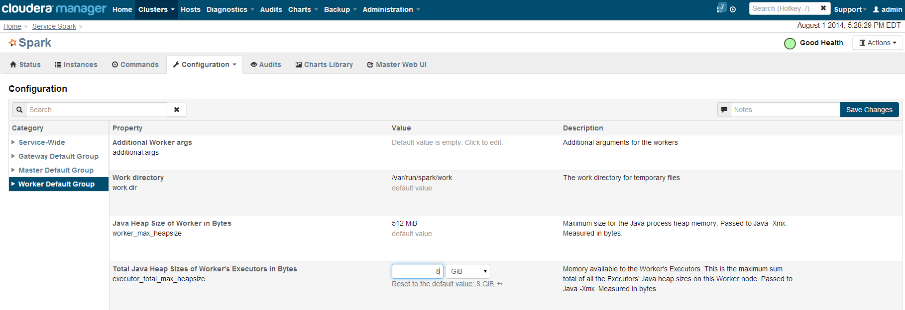

===============
Set Up A Server
===============

------------
Introduction
------------

In this guide we will walk through the Intel Analytics installation and the minimal configuration needed to get the service running.
This guide is not going to walk you through the Cloudera cluster installation since that subject is covered by Cloudera in greater detail.
For brevity Intel Analytics will be referred to as IA going forward.

See `Cloudera Installation Documentation <http://www.cloudera.com/content/cloudera-content/cloudera-docs/CM5/latest/Cloudera-Manager-Installation-Guide/cm5ig_install_cm_cdh.html>`_

------------
Requirements
------------

1. RHEL/Centos 6.4 OS
#. Sudo access is required to install the various IA packages since they are installed through Yum and for the editing of root owned configuration files
#. Cloudera cluster with CDH-5.0.2-p0.13 or greater up to CDH-5.0.3-p0.35 with the following services installed and running.

    A. HDFS
    #. SPARK
    #. Hbase
    #. Yarn(MR2)
    #. Zookeeper

#. Python 2.6
#. EPEL yum repository -- All the nodes on the cluster must have the EPEL yum repository.
   Adding the EPEL repository is straight forward and can be acomplished with a few simple steps.

Before trying to install the EPEL repo run the following command to see if it's already available on the machine you are working on::

    sudo yum repolist

Sample output::

    cloudera-cdh5                              Cloudera CDH, Version 5                                              141
    cloudera-manager                           Cloudera Manager, Version 5.0.2                                        7
    epel                                       Extra Packages for Enterprise Linux 6 - x86_64                    11,022
    rhui-REGION-client-config-server-6         Red Hat Update Infrastructure 2.0 Client Configuration Server 6        2
    rhui-REGION-rhel-server-releases           Red Hat Enterprise Linux Server 6 (RPMs)                          12,690
    rhui-REGION-rhel-server-releases-optional  Red Hat Enterprise Linux Server 6 Optional (RPMs)                  7,168

If the epel repo is missing, run these commands to install the necessary files::

    wget http://download.fedoraproject.org/pub/epel/6/x86_64/epel-release-6-8.noarch.rpm
    rpm -ivh epel-release-6-8.noarch.rpm

To verify the installation run::

    sudo yum repolist

Sample output::

    epel                                             Extra Packages for Enterprise Linux 6 - x86_64                       11,018
    rhui-REGION-client-config-server-6               Red Hat Update Infrastructure 2.0 Client Configuration Server 6           2
    rhui-REGION-rhel-server-releases                 Red Hat Enterprise Linux Server 6 (RPMs)                             12,663
    rhui-REGION-rhel-server-releases-optional    

    Red Hat Update Infrastructure 2.0 Client Configuration Server 6                       rhui-REGION-rhel-server-releases
    Red Hat Enterprise Linux Server 6 (RPMs)                                              12,663rhui-REGION-rhel-server-releases-optional
    Red Hat Enterprise Linux Server 6 Optional (RPMs)                                      7,16

------------------------
Intel Analytics packages
------------------------

The dependency list is merely informational.
When yum installs, it will pull dependencies automatically.
All the Cloudera dependencies are implied for all packages.

IA Rest Server
==============

Package Name: intelanalytics-rest-server

Dependencies

* intelanalytics-python-client
* intelanalytics-graphbuilder
* Java Runtime Environment or Java Development Environment 1.7

IA Python Client
================

Needs to be installed on every spark worker node as well as the gateway node or other machine that is going to be the designated client.
The version must be the same on the IA python client submitting requests, the rest server and the rest client installed on the individual nodes.

Package Name: intelanalytics-python-client

Dependencies

* python 2.6
* python-ordereddict
* python-pip
* numpy >= 1.8.1
* python-pandas >= 0.13.1
* python-bottle >= 0.12
* python-requests >= 2.2.1

IA Graph Builder
================

Needs to be installed with the IA rest server

Package Name: intelanalytics-graphbuilder

Dependencies

* intelanalytics-spark-deps
* jq *
* perl-URI *

\* These dependenicies are only used in a helper script that updates the spark class path in Cloudera manager.
They are not used for any data processing.

IA Spark Dependencies
=====================

Need to be installed on every spark worker node.

Package Name: intelanalytics-spark-deps

Dependencies

* none

------------
Installation
------------

Both 'Intel-analytics-deps' and 'intel-analytics' repositories need to be installed on every node that has a spark worker.

Add Dependency Repository
=========================

We prepackage and host some open source libraries to aid with installations.
In some cases we prepackaged newer versions from what is available in RHEL or EPEL repositories.

To add the dependency repository run the following command::

    wget https://intel-analytics-dependencies.s3-us-west-2.amazonaws.com/ia-deps.repo

    sudo cp ia-deps.repo /etc/yum.repos.d/

If you have issues running the above command, try entering the following, being careful about the placement of the \" characters::

    sudo touch /etc/yum.repos.d/ia-deps.repo
    echo "[intel-analytics-deps]
    name=intel-analytics-deps
    baseurl=https://intel-analytics-dependencies.s3-us-west-2.amazonaws.com/yum
    gpgcheck=0
    priority=1 enabled=1"  | sudo tee -a /etc/yum.repos.d/ia-deps.repo

To test the installation of the dependencies repository run the following command::

    sudo yum info yum-s3

It should print something close to this::

    Available Packages
    Name        : yum-s3
    Arch        : noarch
    Version     : 0.2.4
    Release     : 1
    Size        : 9.0 k
    Repo        : intel-analytics-deps
    Summary     : Amazon S3 plugin for yum.
    URL         : git@github.com:NumberFour/yum-s3-plugin.git
    License     : Apache License 2.0

If you get a similar output install yum-s3 package::

    sudo yum -y install yum-s3

Add Private repository
======================

Copy and paste these contents to '/etc/yum.repos.d/ia.repo'.
If the file doesn't exist create it.
The name of the file doesn't matter as long as it has the .repo file extension.
::

    [intel-analytics]
    name=intel analytics
    baseurl=https://intel-analytics-repo.s3-us-west-2.amazonaws.com/release/yum
    gpgcheck=0
    priority=1
    s3_enabled=1
    #yum-get iam only has get
    key_id=YOUR_KEY
    secret_key=YOUR_SECRET

Alternatively you can run::

    echo "[intel-analytics]
    name=intel analytics
    baseurl=https://intel-analytics-repo.s3-us-west-2.amazonaws.com/release/yum
    gpgcheck=0
    priority=1
    s3_enabled=1
    #yum-get iam only has get
    key_id=YOUR_KEY
    secret_key=YOUR_SECRET" | sudo tee -a /etc/yum.repos.d/ia.repo

Note:
    Don't forget to replace YOUR_KEY, and YOUR_SECRET with the keys that were given to you.

Verify the installation of the IA repository by running::

    sudo yum info intelanalytics-rest-server

Sample output::

    Available Packages
    Name        : intelanalytics-rest-server
    Arch        : x86_64
    Version     : 0.8
    Release     : 1474
    Size        : 419 M
    Repo        : intel-analytics
    Summary     : intelanalytics-rest-server-0.8 Build number: 1474. TimeStamp 20140722211530Z
    URL         : graphtrial.intel.com
    License     : Confidential

If you get package details for intelanalytics-rest-server package, then the repository installed correctly and you can continue installation.

--------------
IA rest server
--------------

This next step is going to install IA rest server and all it's dependencies.
Only one instance of the rest server needs to be installed.
Although it doesn't matter where it's installed, it's usually installed on the same node where spark master is running.
::

    sudo yum -y install intelanalytics-rest-server

Configuration
=============

Before starting the server you must edit two config files /etc/default/intelanalytics-rest-server,
/etc/intelanalytics/rest-server/application.conf.tpl and set the spark classpath in cloudera manager.

/etc/default/intelanalytics-rest-server:
----------------------------------------

In /etc/default/intelanalytics-rest-server we need to set spark_home to the correct location according to your cloudera installation.
If you open the file it will look something like this::

    #intelanalytics-rest-server env file
    #Set all your environment variables needed for the rest server here
    # depending on the CDH install method used, set the appropriate SPARK_HMOE below

    #export SPARK_HOME="/usr/lib/spark"
    #export SPARK_HOME="/opt/cloudera/parcels/CDH/lib/spark"
    export IA_JVM_OPT="-XX:MaxPermSize=256m"
    export EXTRA_CONF=`hbase classpath`export IAUSER="iauser"

We want to change the SPARK_HOME variable.
If your cloudera cluster is parcel based use "/opt/cloudera/parcels/CDH/lib/spark".
If your cloudera cluster is packaged base like RPM, DEB use "/usr/lib/spark".

/etc/intelanalytics/rest-server/application.conf.tpl:
-----------------------------------------------------

The rest-server package only provides a configuration template called application.conf.tpl.
We need to copy and rename this file to application.conf and make 3 changes to the contents.
First lets rename the file::

    sudo cp /etc/intelanalytics/rest-server/application.conf.tpl /etc/intelanalytics/rest-server/application.conf

The three updates we will make will change the bind ip address, point to the correct hdfs location, and setting of the zookeeps host names.

Edit the config file with your editor of choice (we use vim for example), and make the three changes::

    sudo vim /etc/intelanalytics/rest-server/application.conf

1. Update the bind ip addres for the rest server.
    Look for the following section in application.conf::

        api {     
        //identifier = "ia"
        #bind address
        //host = "127.0.0.1"
        #bind port 
        //port = 9099 
        //defaultCount = 20
        //defaultTimeout = 30
        }

    If you wish to use the rest server outside of the machine it's installed on you will need to change ``//host = "127.0.0.1`` to ``host =  "0.0.0.0"``
    to get it to bind to all ip address when it's booting.
    Don't forget to remove pre-pended forward slashes ``//`` for the change to get picked up by the rest server.

    After your changes it should look something like this::

        api {     
        //identifier = "ia"     
        #bind address     
        host = "0.0.0.0"     
        #bind port     
        //port = 9099     
        //defaultCount = 20     
        //defaultTimeout = 30
        }

2. Update the rest servers file system root.
    Look for the following section in application.conf

        fs {
        # the system will create an "intelanalytics" folder at this location, if set,     
        # or at the root of the filesystem, if not. All Intel Analytics Toolkit files will     
        # be stored somehwere under that base location.     
        #     
        # For example, if using HDFS, set the root to hdfs path     
        # root = "hdfs://MASTER_HOSTNAME/some/path"     
        #     
        # If running in local mode, this might be a better choice:     
        //root = ${user.home}     
        root = "hdfs://localhost/user/iauser"   
        }

    Update ``localhost`` in ``root = "hdfs://localhost/user/iauser`` to point to the fully qualified domain of your HDFS installation.
    The ``/user/iauser`` hdfs directory should already exist since it's created by the rpm on installation.

3. Update the zookeeper host list.
    Look for the following section in application.conf::

        titan {
              load {
                # documentation for these settings is available on Titan website
                storage {
                  //backend = "hbase"
                  # with clusters the hostname should be a comma separated list of host names with zookeeper role assigned
                  //hostname = "localhost"
                  //port = "2181"
                  //batch-loading = "true"
                  //buffer-size = 2048
                  //attempt-wait = 300
                  //lock-wait-time = 400
                  //lock-retries = 15
                  //idauthority-retries = 30
                  //read-attempts = 6
                  // Pre-split settngs for large datasets
                  // region-count = 100
                  // short-cf-names = "true"

                }

                //autotype = "none"

                ids {
                  //block-size = 300000
                  //renew-timeout = 150000
                }
              }
            }

    Update localhost in ``//hostname = "localhost"`` to the hosts with zookeeper role assigned, for example,  ``hostname = "node01,node02,node03"``.
    Don't forget to remove pre-pended forward slashes ``//`` for the change to get picked up by the rest server.

4. Set the spark classpath.
---------------------------
Run the following command to set the spark class path::

    /usr/lib/intelanalytics/graphbuilder/set-cm-spark-classpath.sh

Follow the prompts and make corrections where necessary.

If you have problems running the script, you can update the spark class path through cloudera manager.
If you log into cloudera manager under the spark configuration you can find the spark-conf/spark-env.sh setting.
If it isn't already set add::

    export SPARK_CLASSPATH="/usr/lib/intelanalytics/graphbuilder/lib/*"

Then restart the spark service.

Wait until IA spark deps and IA python rest client are installed before you start the rest server.

IA spark deps:
--------------

After setting up the IA repositories, run the following command on every host with a spark worker::

    sudo yum -y install intelanalytics-spark-deps

IA python rest client:
----------------------

After setting up the IA repositories, run the following command on every host with a spark worker::

    sudo yum -y install intelanalytics-python-rest-client

After installing IA spark deps and IA python rest client, you can start the rest server and start submitting requests.

Starting IA Rest Server:
------------------------

Starting the Rest server is very easy.
It can be started like any other linux service::

    sudo service intelanalytics-rest-server start

After starting the rest server you can browse to the host on port 9099 to see if the server started successfully.

Troubleshooting:
----------------

The log files get written to /var/log/intelanalytics/rest-server/output.log or sudo tail \-f /var/log/intelanalytics/rest-server/application.log.
If you are having issues starting or runnning jobs, tail either log to see what error is getting reported while running the task::

    sudo tail -f /var/log/intelanalytics/rest-server/output.log

or::

    sudo tail -f /var/log/intelanalytics/rest-server/application.log

