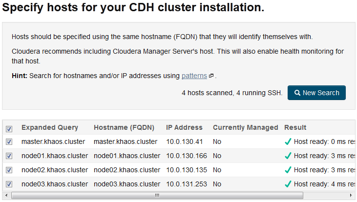
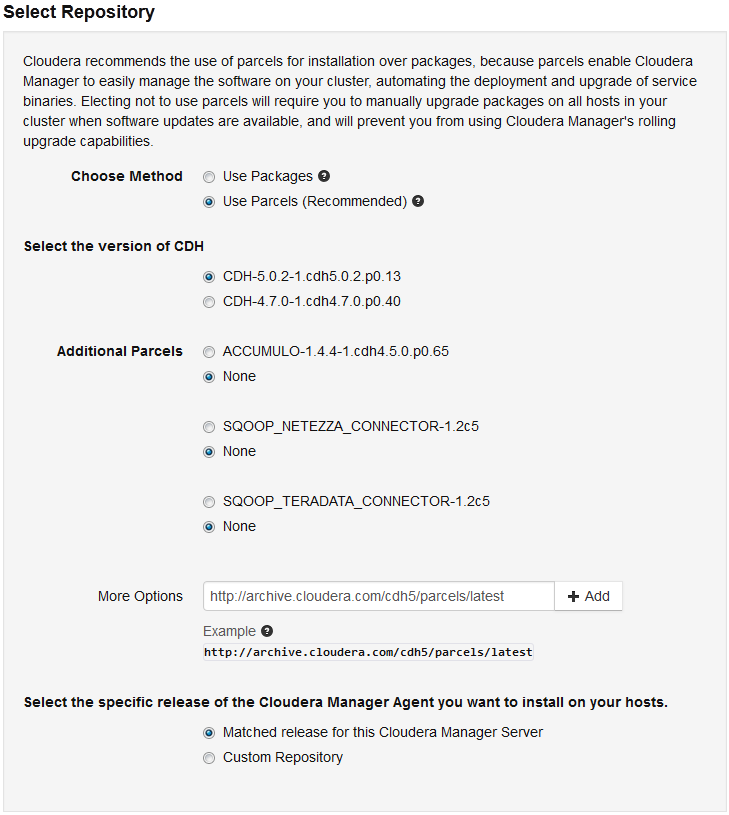
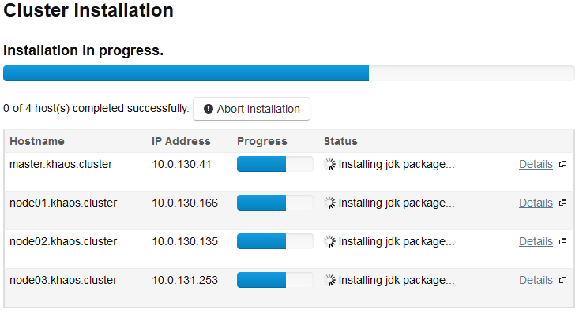
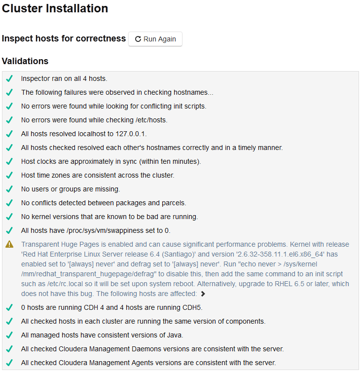
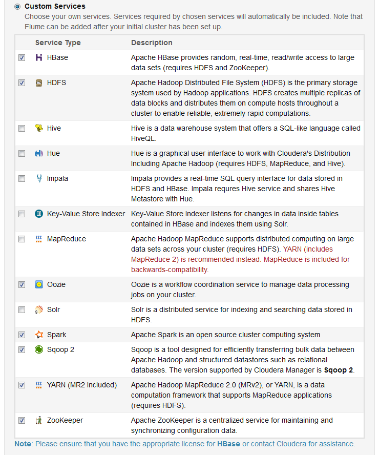
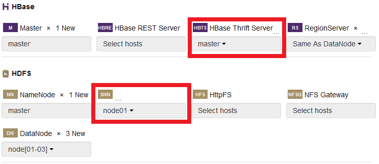
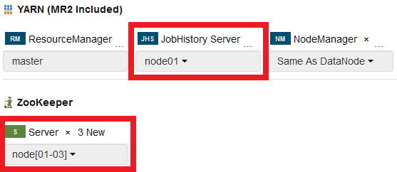
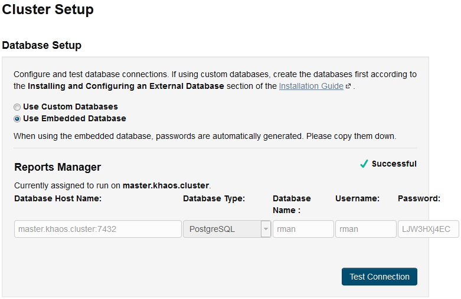
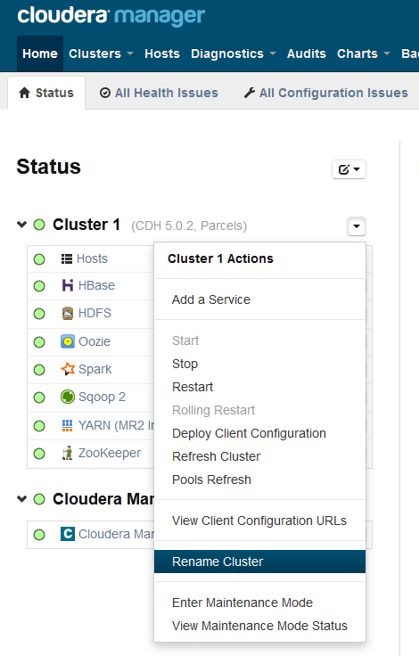
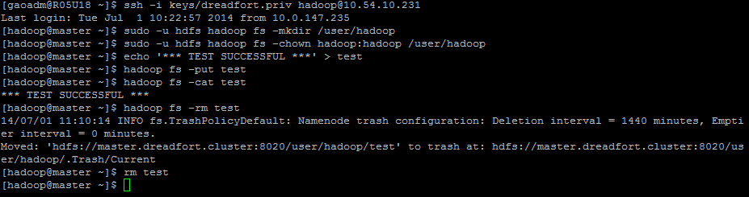

===============================
Cloudera Hadoop 5 Configuration
===============================

This guide will walk you through the process of configuring Cloudera Hadoop 5 on a physical or virtual cluster.

-------------------
1. Setup Work Space
-------------------

At this point, you should have either a virtual or physical cluster and have run cloudera-manager-installer.bin on the machine's master node.
If you have not reached this point, go back to either the physical or virtual cluster setup tutorials. 

A. Open an SSH window to the master node of the cluster.
#. Open a web browser to the Cloudera manager by typing the public address of the master node on port 7180. (EX: 10.54.10.187:7180)
#. Sign in with username "admin" and password "admin"

-------------------------------------
2. Set Proxy Info in Cloudera Manager
-------------------------------------

.. ifconfig:: internal_docs

    The first step to take in the Cloudera Manager web interface is to add JF's proxy information.

    A. Click the "Cloudera Manager" hyperlink graphic on the top left portion of the window.
    #. Click the Administration drop-down along the top of the window, then select Settings.
    #. Select the Network button long the menu pane to the left
    #. In the Proxy Server field, enter proxy.jf.intel.com
    #. In the Proxy Port field, enter 911
    #. Hit the Save Changes button to the top right of the active menu
    #. Hit the admin drop-down menu at the top right corner of the window and logout
    #. Log back in using the same admin admin username password combo

.. ifconfig:: internal_docs == False

    The first step to take in the Cloudera Manager web interface is to add your proxy information.

    A. Click the "Cloudera Manager" hyperlink graphic on the top left portion of the window.
    #. Click the Administration drop-down along the top of the window, then select Settings.
    #. Select the Network button long the menu pane to the left
    #. In the Proxy Server field, enter the proxy qualified name, for example, "proxy.my.company.com"
    #. In the Proxy Port field, enter your proxy port number
    #. Hit the Save Changes button to the top right of the active menu
    #. Hit the admin drop-down menu at the top right corner of the window and logout
    #. Log back in using the same admin admin username password combo

----------------------
3. Submit License File
----------------------

.. ifconfig:: internal_docs

    To complete this step, you must first acquire the "intel_bda_graph_analytics_lab_machines_dev_cloudera_enterprise_license.txt" file,
    which can be found in the "licenses" folder of either the build server or the CLC.

    A. Under the Cloudera Enterprise column, click on the empty text field to the left of the Upload button
    #. Select the license file
    #. Hit the Upload button
    #. Hit Continue on the bottom right of the window  

.. ifconfig:: internal_docs == False

    To complete this step, you must first acquire the Cloudera license file.

    A. Under the Cloudera Enterprise column, click on the empty text field to the left of the Upload button
    #. Select the license file
    #. Hit the Upload button
    #. Hit Continue on the bottom right of the window  

-------------------
4. Specifying Hosts
-------------------

This step connects your master node to the rest of the cluster.
The syntax used to search for hostnames is identical to what you will find in the /etc/hosts file of each node in the cluster. 

Hit Continue through the "Thank you for choosing Cloudera Manager and CDH" window.
In the text field, enter the hostnames of each node in the following syntax::

    master.clustername.cluster
    node[01-03].clustername.cluster

Where ``clustername`` is the name of your cluster,
and ``[01-03]`` is the range of slave nodes in your cluster (``[01-07]`` for an 8 node cluster,
``[01-15]`` for a 16 node cluster).

Hit Search and make sure that you detect as many hosts as there are nodes in your cluster.
Check below images for examples.
If all correct hosts are selected, hit Continue.
Otherwise, click New Search. 

--------------------
5. Select Repository
--------------------

At this point, you must complete step 3 to continue if you have not yet already.

In Custom Repository field (NOT "Custom Repository" button drop-down), enter::

    http://archive.cloudera.com/cdh5/parcels/latest

Hit the Add button to the right of the text field.
Wait around a minute then hit the Continue button when it lights up.

-------------------------------- 
6. Provide SSH Login Credentials
-------------------------------- 

A. Hit Continue through the "Configure Java Encryption" page
#. In "Provide SSH Login Credentials" page, select the Another user button
#. In the text field that appears, enter hadoop
#. Select the All hosts accept same private key button below
#. Hit the Browse button that appears and select the private key for the cluster.
   If the private key is not yet on your local machine, transfer it from the CLC's keys folder using a program like WinSCP. 
#. Click Continue
#. Click Okay when prompted "Continue SSH login with no passphrase?"

-----------------------------------------
7. Wait Through Installation on All Nodes
-----------------------------------------

The next couple of windows are just progress bars.
If any of them fail and turn red, sometimes just hitting "Retry" will fix the problem nodes.

Hit Continue button when it lights up after the progress bar fills.
You will be greeted by more progress bars.
Wait and hit Continue when they finish too.   

-------------------------------- 
8. Inspect Hosts for Correctness
-------------------------------- 

Check that the host inspector doesn't throw any critical errors at you.
The "Transparent Huge Pages is enabled" warning is okay.
Take note of anything else that doesn't have a green check mark next to it.

Click Finish

------------------------------------------------------ 
9. Choose the CDH5 Services to Install On Your Cluster
------------------------------------------------------ 

The following windows will bring you through the process of installing services and roles on each node in the cluster.
This is our default setup.

In the "Choose a combination of services to install" dialogue, select the "Custom Services" button.
In the drop-down menu, mark the following boxes:

* HBase
* HDFS
* Oozie
* Spark
* Sqoop 2
* YARN (MR2 Included)
* ZooKeeper

Click Continue.                

------------------------------
10. Customize Role Assignments
------------------------------

This page allows you to designate which roles your different nodes will take up.
In a default loadout, almost all of these fields will be left to their default, but there are four that need to be changed.

1. Under the HBase section, click on the HBase Thrift Server dialogue and select master
#. Under the HDFS section, click on the Secondary Name Node dialogue and select node01
#. Under the YARN section, click on the JobHistory Server dialogue and select node01
#. Under the ZooKeeper section, click on the Server dialogue and select node01, node02, node03. 

Leave all other fields in their default values and click Continue.

Changes to make near the top:

 

Changes to make near the bottom:

 
------------------ 
11. Database Setup
------------------ 

The "Database Host Name" field should auto-populate with "master.clustername.cluster:7432". If not, fill that in.

Click Test Connection.
If successful, click Continue.

 
------------------ 
12. Review Changes
------------------ 

In this window, all fields but one should remain their default values.

Alerts: Mail Message Recipients should be changed from root@localhost to hadoop@localhost

Click Continue.   

------------------------------------
13. Finishing Up in Cloudera Manager
------------------------------------

The next page requires no interaction. Just more loading bars.

1. Wait for all services to start up, then hit Continue
#. In the "Congratulations!" window, click Finish
#. Some of the health indicators may be orange or red in the first few moments of the cluster's life.
   Wait a minute for them to all turn green.
#. In the Cloudera Manager page, change the name of the cluster by hitting the drop down arrow to the right of the Cluster 1 heading
   then clicking Rename Cluster
#. In the Cloudera Manager, hit the admin drop-down at the top right corner of the screen and select Change Password.
   Change the password to the cluster's name (lowercase).
   This is to prevent developers from accidentally logging into another developer's cluster.

 
---------------------------- 
14. Final Settings and Tests
---------------------------- 

The final steps are to create a home directory for the hadoop user and test HDFS.
In a terminal window, SSH into the master node of the cluster as the hadoop user and enter the following commands::

    sudo -u hdfs hadoop fs -mkdir /user/hadoop
    sudo -u hdfs hadoop fs -chown hadoop:hadoop /user/hadoop
    echo '*** TEST SUCCESSFUL ***' > test
    hadoop fs -put test
    hadoop fs -cat test
    hadoop fs -rm test
    rm test

These commands create a test file, attempts to put the test file into HDFS, and then tries to cat that file's content.
If the cat command gives the output "*** TEST SUCCESSFUL ***" then it works!
The final commands remove the test file from both HDFS and home directory.

Sample output:

 
Congratulations! You just finished your cluster setup. Now you just need to hand it off.

---------------------------------------------
15. Handing Off Finished Cluster to Developer
---------------------------------------------

There are two steps to handing off a key to a developer. The first is to give the owner the cluster's private key: 

1. Open a new SSH window to build node (gaoadm@10.54.8.246).
#. sudo su into the owner's account.
   If the cluster owner does not have an account on the build server, create one for them then contact Isaac so the account can be cobbled.
#. scp the private key into the owners .ssh directory from the CLC's keys directory.

All that's left now is to email the owner with the information about their new cluster.
All cluster releases should contain at least this information:

1. Where to find the key (build server, .ssh directory)
#. Public IP of at least the master node
#. The password to the Cloudera Manager is the cluster's name (lowercase)

If the user is new to this distribution model (doesn't have any other cluster keys in their .ssh folder),
also let them know about this server and that it is not a jump node and they can pull the key down to whatever machine they'd prefer to log on from.  
