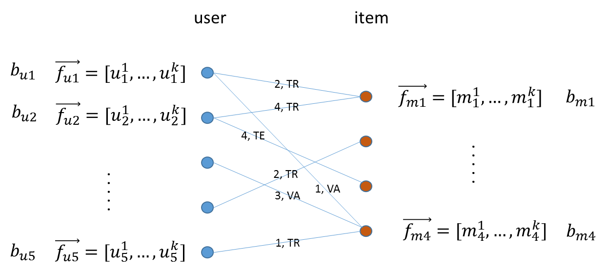

Machine Learning Algorithms
===========================

In this release of the Intel® Data Platform: Analytics Toolkit, we support eight graphical algorithms in iGiraph. From a functionality point of view, they fall into these categories: Collaborative Filtering, Graph Analytics, Graphical Models, and Topic Modeling.
Collaborative Filtering
Alternating Least Squares
Conjugate Gradient Descent
Graph Analytics
Average Path Length
Connected Components
Page Rank
Graphical Models
Label Propagation
Loopy Belief Propagation
Topic Modeling
Latent Dirichlet Allocation
Collaborative Filtering
Collaborative filtering (CF) is widely used in recommender systems.
See: http://en.wikipedia.org/wiki/Collaborative_filtering
We support two collaborative filtering algorithms: Alternating Least Square (ALS) and Conjugated Gradient Descent (CGD). 

Alternating Least Squares
-------------------------

We use the Alternating Least Squares with Bias for collaborative filtering algorithms.
http://columbiadatascience.com/2012/10/18/week-7-hunch-com-recommendation-engines-svd-alternating-least-squares-convexity-filter-bubbles/
Our implementation is based on the following paper.
Y. Zhou, D. Wilkinson, R. Schreiber and R. Pan. Large-Scale Parallel Collaborative Filtering for the Netflix Prize. 2008.
Y. Koren. Factorization Meets the Neighborhood: a Multifaceted Collaborative Filtering Model. In ACM KDD 2008. (Equation 5)
http://public.research.att.com/~volinsky/netflix/kdd08koren.pdf
This algorithm for collaborative filtering is widely used in recommendation systems to suggest items (products, movies, articles, and so on) to potential users based on historical records of items that all users have purchased, rated, or viewed. The records are usually organized as a preference matrix P, which is a sparse matrix holding the preferences (such as, ratings) given by users to items. Within collaborative filtering approaches, ALS falls in the category of the matrix factorization/latent factor model that infers user profiles and item profiles in low-dimension space, such that the original matrix P can be approximated by a linear model. 

The ALS Model
-------------

A typical representation of the preference matrix P in Giraph is a bipartite graph, where nodes at the left side represent a list of users and nodes at the right side represent a set of items (such as, movies), and edges encode the rating a user provided to an item. To support training, validation, and test, a common practice in machine learning, each edge is also annotated by "TR", "VA" or "TE".

After executing ALS on the input bipartite graph, each node in the graph will be associated with a vector (f_* ) ? of length k, where k is the feature dimension is specified by the user, and a bias term b_*. ALS optimizes (f_* ) ?  and b_* alternatively between user profiles and item profiles such that the following l2 regularized cost function is minimized:

Here the first term strives to find (f_* ) ?’s and b_*’s that fit the given ratings, and the second term (l2 regularization) tries to avoid overfitting by penalizing the magnitudes of the parameters, and ? is a tradeoff parameter that balances the two terms and is usually determined by cross validation (CV).

After the parameters (f_* ) ? and b_* are determined, given an item mj the rating from user ui can be predicted by a simple linear model:

ALS Example Usage
-----------------

Input data format
-----------------

The ALS algorithm takes an input data represented in CSV, JSON or XML format. We use aCSV file as an example. Each CSV file consists of at least five columns as shown in the example below. The user column is a list of user IDs. The movie column is a list of movie IDs. The rating column records how the user rates the movie in each row. The vertex_type labels the type of the source vertex in each row. It labels which nodes will be on the "left-side" and which nodes will be on the "right-side" in the bi-partite graph we are building. The splits column specifies this row of data is for train, validation, or test. We used TR, VA, TE for these three types of splits, respectively.

Data import
-----------

To import the ALS input data, use the following ipython calls we provided.

The example above loads the ALS input data from a CSV file. The first line imports the needed python modules. The second line gets the frame builder into the fb object. The third line specifies the path to the input file. The rest of the lines import the input data. Here is a detailed description of the build_from_csv method. 

The first argument is the name you want to give to the frame. We used AlsFrame in this example.

The second argument specifies that this is a csv file.

The third argument is the schema of the input data. You need to name each column, and specify the data type of each column in your input CSV input data. 

The fourth argument is whether to overwrite the frame if you have imported data to the AlsFrame before.

Graph Construction
------------------

After you import the raw data, you register which fields to use for source vertex, which fields to use for target vertex, and then construct a graph from your input data.

In the example above, the first two lines import python modules related to graph construction, and get the graph builder object into gb. The third to fifth lines register the graph. Line three registers user column as the source vertex and registers the vertex property vertex_type to this vertex. Line four registers movie column as the target vertex. The fifth line registers an edge from user to movie, with the label rates. Additionally, rating and splits are two edge properties registered for this algorithm. Finally, line 6 builds a graph named AlsGraph based on the input data and graph registration. The overwrite option overwrites a pre-existing graph with the same name.

Run ALS algorithm
-----------------

After graph construction, run the ALS algorithm as follows:

In the example above, the first line calls to the algorithm. The second line specifies which edge property you want to use for the ALS algorithm. Line three specifies which edge label you want to use for this algorithm. Line four specifies the property name for the vertex type, here we use vertex_type. Line five specifies the property name for edge type, in this case, splits. Line six specifies that at the most we want to run 20 super steps for this algorithm. Line seven configures three feature dimensions for ALS. Line eight sets the convergence threshold to 0. Line nine sets als_lamda to 0.065. Line ten specifies to output learning at each iteration. Line eleven turns bias calculation on. Line twelve specifies which vertex property names to use for ALS results. Because we configured three feature dimensions: als_p0, als_p1, als_p2, the algorithm will store the results for feature dimension 0, 1, and 2 respectively. Because bias term update is on, als_bias will store the bias term result.

Depending on your use case, you may want to save your ALS results in one vertex property with a vector value for each vertex, and not in separate vertex properties. We also support this scenario, if you want to do it that way. The example below shows how to use this feature.

The first eleven lines are the same as the previous example. The difference is at Line twelve and Line thirteen. Line twelve enables using a vector as a vertex property value. Line thirteen specifies the property name to use to save the ALS results. In this case, the result will be stored in als_results in a comma separated list. The bias result will be stored in als_bias. 

The code looks like this:

>>> Required Parameters:
>>> input_edge_property_list : List (comma-separated list of strings)
        The edge properties which contain the input edge 
        values. If you use more than one edge property, we expect a 
        comma-separated string list.
>>> input_edge_label : String
        The edge property which contains the edge label.
>>> output_vertex_property_list : List (comma-separated list of strings)
        The vertex properties which contain the output vertex 
        values. If you use more than one vertex property, we expect a 
        comma-separated string list.
>>> vertex_type : String
        The vertex property which contains the vertex type.
>>> edge_type : String
        The edge property which contains edge type.
>>> num_mapper : String, optional
        A reconfigured Hadoop parameter mapred.tasktracker.map.tasks.maximum.
        Use on the fly when needed for your data sets.
>>> mapper_memory : String, optional
        A reconfigured Hadoop parameter mapred.map.child.java.opts. 
        Use on the fly when needed for your data sets.
>>> vector_value : String, optional
        "True" means the algorithm supports a vector as a vertex value.
        "False" means the algorithm does not support a vector as a vertex value.
>>> num_worker : String, optional
        The number of Giraph workers.
        The default value is 15.
>>> max_supersteps : String, optional
        The number of super steps to run in Giraph.
        The default value is 10.
>>> feature_dimension : String, optional
        The feature dimension.
        The default value is 3.
>>> als_lambda : String, optional
        The regularization parameter:
        f = L2_error + lambda*Tikhonov_regularization
        The default value is 0.065.
>>> convergence_threshold : String, optional
        The convergence threshold which controls how small the change in 
        validation error must be in order to meet the convergence criteria.
        The default value is 0.
>>> learning_output_interval : String, optional
        The learning curve output interval.
        The default value is 1.
        Because each ALS iteration is composed of 2 super steps, the default 
        one iteration means two super steps.
>>> max_val : String, optional
        The maximum edge weight value.
        The default value is Float.POSITIVE_INFINITY.
>>> min_val : String, optional
        The minimum edge weight value.
        The default value is Float.NEGATIVE_INFINITY.
>>> bidirectional_check : String, optional
        If it is true, Giraph will check whether each edge is bidirectional.
            The default value is "False".
>>> bias_on : String, optional
        True means turn bias calculation on, and False means turn bias calculation off.
        The default value is false.
>>> Returns
>>> -------
        output : AlgorithmReport
        After execution, the algorithm's results are stored in the database. The convergence 
       curve is accessible through the report object.

For a more complete definition of the Lambda parameter, see the Glossary.

Example
-------

>>> Graph.ml.als(
                input_edge_property_list="source",
                input_edge_label=”link",
                output_vertex_property_list="als_results, als_bias",
                vertex_type="vertex_type",
                edge_type="edge_type",
                num_worker="3",
                max_supersteps="20",
                feature_dimension="3"
                als_lambda="0.065",
                convergence_threshold="0.0",
                learning_output_interval="1",
                max_val="5",
                min_val="1"
                bidirectional_check="false",
                bias_on="true"
    )

Conjugate Gradient Descent
--------------------------

See: http://en.wikipedia.org/wiki/Conjugate_gradient_method.

The Conjugate Gradient Descent (CGD) with Bias for collaborative filtering algorithm.

Our implementation is based on the following paper.
1) Y. Koren. Factorization Meets the Neighborhood: a Multifaceted Collaborative Filtering Model. In ACM KDD 2008. (Equation 5)
http://public.research.att.com/~volinsky/netflix/kdd08koren.pdf

This algorithm for collaborative filtering is used in recommendation systems to suggest items (products, movies, articles, and so on) to potential users based on historical records of items that all users have purchased, rated, or viewed. The records are usually organized as a preference matrix P, which is a sparse matrix holding the preferences (such as, ratings) given by users to items. Similar to ALS, CGD falls in the category of matrix factorization/latent factor model that infers user profiles and item profiles in low-dimension space, such that the original matrix P can be approximated by a linear model.

Comparison between CGD and ALS
------------------------------

The CGD model is the same as that of ALS except that CGD employs the conjugate gradient descent instead of least squares in optimization. Refer to the ALS discussion above for more details on the model. CGD and ALS share the same bipartite graph representation and the same cost function. The only difference between them is the optimization method.

ALS solves the optimization problem by least squares that requires a matrix inverse. Therefore, it is computation and memory intensive. But ALS, a 2nd-order optimization method, enjoys higher convergence rate and is potentially more accurate in parameter estimation.

On the otherhand, CGD is a 1.5th-order optimization method that approximates the Hessian of the cost function from the previous gradient information through N consecutive CGD updates. This is very important in cases where the solution has thousands or even millions of components. CGD converges slower than ALS but requires less memory.

Whenever feasible, ALS is a preferred solver over CGD, while CGD is recommended only when the application requires so much memory that it might be beyond the capacity of the system.

CGD Example Usage
-----------------

Input data format
-----------------

The CGD algorithm takes input data represented in CSV, JSON or XML format. In this example, we use a CSV file. Each CSV file consists of at least five columns as shown in the table below. The user column is a list of user IDs. The movie column is a list of movie IDs. The rating column records how the user rates the movie in each row. The vertex_type labels the type of the source vertex in each row. The splits column specifies if this row of data is for training, validation, or testing. We used TR, VA, TE for these three types of splits, respectively.

Data import
-----------

To import the CGD data, use the following ipython calls that we provide, as shown below.

The example above shows how to load CGD input data from a CSV file. The first line imports the related python modules. The second line gets the frame builder into the fb object. The third line specifies the path to the input file. The rest of the lines import the input data. Here is detailed description of the build_from_csv method.

The first argument is the name you want to give to the frame. We use CgdFrame in this example.

The second argument is the path to your input file, in this case, /user/hadoop/cgd.csv.

The third argument is the schema of the input data. You need to name each column, and specify the data type of each column in your input CSV input data.

The fourth argument is whether to overwrite the frame if you have imported data to CGDFrame frame before.

Graph Construction
------------------

After you import the raw data, you register which fields to use for the source vertex, which fields to use for the target vertex, and then construct a graph from your input data.

In the example above, the first line imports the graph construction related python modules. The second line gets the graph builder object into gb. The third to fifth lines register your graph, that is, configure. The third line registers the user column as the source vertex, and registers the vertex_type vertex property to this vertex. The fourth line registers the movie column as the target vertex. The fifth line registers that each edge from user to movie, with the label rates. Also, rating and splits are two edge properties registered for this algorithm. The sixth line builds a graph based on your input data and graph registration, with graph nameCgdGraph. The overwrite=True in this line means that if you have previously built a graph with the same name, you want to overwrite the old graph.

Run CGD algorithm
-----------------

After graph construction, run the CGD algorithm, as shown in the example below.

In the example above, the first line calls the algorithm. The second line specifies which edge property you want to use for the CGD algorithm. The third line specifies which edge label you want to use for this algorithm. Line four specifies the property name for vertex type. We registered vertex_type for the vertex type above. Line five specifies the property name for edge type. Previously, we registered splits for the edge type. Line six specifies that at most we want to run 20 super steps for this algorithm. Line seven configures three feature dimensions for CGD. Line eight sets the convergence threshold to 0. Line nine sets cgd_lamda to 0.065. Line ten sets output learning to each iteration. Line eleven turns bias calculation on. Line twelve sets the run to three iterations in each super step. Line thirteen specifies which vertex property names to use for the CGD results. Because we configured three feature dimensions: cgd_p0, cgd_p1, and cgd_p2; CGD will store the results for feature dimension 0, 1, and 2 respectively. Because bias term update is turned on, cgd_bias will store the bias term result.

Depending on your use case, you may want to save your CGD results in one vertex property with vector values for each vertex, and not in separate vertex properties. We also support this scenario. The example below shows how to use this feature.

The first twelve lines are the same as the previous example. The difference is at lines thirteen and fourteen. Line thirteen enables using vector as a vertex property value. Line fourteen specifies the property name to use to save the CGD results. In this case, the result will be stored in cgd_results in a comma separated list. The bias result will be stored in cgd_bias.

>>> Required parameters:
>>> input_edge_property_list : List (comma-separated list of strings)
        The edge properties which contain the input edge values. 
        If you use more than one edge property. We expect a 
        comma-separated string list.
>>> input_edge_label : String
        The edge property which contains the edge label.
>>> output_vertex_property_list : List (comma-separated list of strings)
        The vertex properties which contain the output vertex values. 
        If you use more than one vertex property, we expect a 
        comma-separated string list.
>>> vertex_type : String
        The vertex property which contains the vertex type.
>>> edge_type : String
        The edge property which contains the edge type.
>>> num_mapper : String, optional
        A reconfigured Hadoop parameter mapred.tasktracker.map.tasks.maximum, 
        use on the fly when needed for your data sets.
>>> mapper_memory : String, optional
        A reconfigured Hadoop parameter mapred.map.child.java.opts,
        use on the fly when needed for your data sets.
>>> vector_value: String, optional
        "True" means the algorithm supports a vector as a vertex value.
        "False" means the algorithm does not support a vector as a vertex value.
>>> num_worker : String, optional
        The number of Giraph workers.
        The default value is 15.
>>> max_supersteps :  String, optional
        The number of super steps to run in Giraph.
        The default value is 10.
>>> feature_dimension : String, optional
        The feature dimension.
        The default value is 3.
>>> cgd_lambda : String, optional
        The regularization parameter: 
        f = L2_error + lambda*Tikhonov_regularization
        The default value is 0.065.
>>> convergence_threshold : String, optional
        The convergence threshold which controls how small the change in validation 
        error must be in order to meet the convergence criteria.
        The default value is 0.
>>> learning_output_interval : String, optional
        The learning curve output interval.
        The default value is 1.
        Because each CGD iteration is composed by 2 super steps, the default one 
        iteration means two super steps.
>>> max_val : String, optional
        The maximum edge weight value.
        The default value is Float.POSITIVE_INFINITY.
>>> min_val : String, optional
        The minimum edge weight value.
        The default value is Float.NEGATIVE_INFINITY.
>>> bias_on : String, optional
        True means turn on bias calculation and False means turn off bias calculation.
        The default value is false.
>>> bidirectional_check : String, optional
        If it is true, Giraph will check whether each edge is bidirectional.
            The default value is "False".
>>> num_iters : 
        The number of CGD iterations in each super step.
        The default value is 5.
>>> After execution, the algorithm's results are stored in database. The convergence 
    curve is accessible through the report object.
>>> Example
>>> Graph.ml.cgd(
               input_edge_property_list="rating",
               input_edge_label="rates",
               output_vertex_property_list="cgd_results, cgd_bias",
               vertex_type="vertex_type",
               edge_type="edge_type",
               num_worker="3",
               max_supersteps="20",
               feature_dimension="3",
               cgd_lambda="0.065",
               convergence_threshold="0.001",
               learning_output_interval="1",
               max_val="10",
               min_val="1",
               bias_on="false",
               num_iters="3")

Graph Analytics
---------------

We support three algorithms in this category. 

Average Path Length
-------------------

The average path length algorithm calculates the average path length from a vertex to any other vertices.

>>> Parameters
>>> ----------
>>> input_edge_label : String
        The edge property which contains the edge label.
>>> output_vertex_property_list : List (comma-separated list of strings)
        The vertex properties which contain the output vertex values.
        If you use more than one vertex property, we expect a comma-separated string list.

>>> num_mapper : String, optional
        A reconfigured Hadoop parameter mapred.tasktracker.map.tasks.maximum.
        Use on the fly when needed for your data sets.
>>> mapper_memory : String, optional
        A reconfigured Hadoop parameter mapred.map.child.java.opts.
        Use on the fly when needed for your data sets.
>>> convergence_output_interval : String, optional
        The convergence progress output interval.
        The default value is 1, which means output every super step.
>>> num_worker : String, optional
        The number of Giraph workers.
        The default value is 15.

>>> Returns
>>> -------
>>> Output : AlgorithmReport
        The algorith's results in the database. The progress
        curve is accessible through the report object.

Example
-------

>>> graph.ml.avg_path_len(
                input_edge_label="edge",
                output_vertex_property_list="apl_num, apl_sum",
                convergence_output_interval="1",
                num_worker="3"
    )

Connected Components
--------------------

The connected components algorithm finds all connected components in graph. The implementation is inspired by PEGASUS paper.

>>> Parameters
>>> ----------
>>> input_edge_label : String
        The edge property which contains the edge label.
>>> output_vertex_property_list : List (comma-separated string list)
        The vertex properties which contain the output vertex values. If you use 
        more than one vertex property, we expect a comma-separated string list.

>>> num_mapper : String, optional
        A reconfigured Hadoop parameter mapred.tasktracker.map.tasks.maximum.
        Use on the fly when needed for your data sets.
>>> mapper_memory : String, optional
        A reconfigured Hadoop parameter mapred.map.child.java.opts.
        Use on the fly when needed for your data sets.
>>> convergence_output_interval : String, optional
        The convergence progress output interval.
        The default value is 1, which means output every super step.
>>> num_worker : String, optional
        The number of Giraph workers.
        The default value is 15.

>>> Returns
>>> -------
>>> output : AlgorithmReport
        The algorithm's results in the database. The progress curve is
        accessible through the report object.

Example
-------

>>> graph.ml.connected_components(
                input_edge_label="connects",
                output_vertex_property_list="component_id",
                convergence_output_interval="1",
                num_worker="3"
    )

Page Rank
---------

This is the algorithm used by web search engines to rank the relevance of the pages returned by a query.
See: http://en.wikipedia.org/wiki/PageRank.

>>> Parameters
>>> input_edge_label : String
        The edge property which contains the edge label.
>>> output_vertex_property_list : List (comma-separated list of strings)
        The vertex properties which contain the output vertex values. 
        If you use more than one vertex property, we expect a comma-separated string list.
>>> num_mapper : String, optional
        A reconfigured Hadoop parameter mapred.tasktracker.map.tasks.maximum.
        Use on the fly when needed for your data sets.
>>> mapper_memory : String, optional
        A reconfigured Hadoop parameter mapred.map.child.java.opts.
        Use on the fly when needed for your data sets.
>>> num_worker : String, optional
        The number of Giraph workers.
        The default value is 15.
>>> max_supersteps : String, optional
        The number of super steps to run in Giraph.
        The default value is 20.
>>> convergence_threshold : String, optional
        The convergence threshold which controls how small the change in belief value 
        must be in order to meet the convergence criteria.
        The default value is 0.001.
>>> reset_probability : String, optional
        The probability that the random walk of a page is reset.
        The default value is 0.15.
>>> convergence_output_interval : String, optional
        The convergence progress output interval.
        The default value is 1, which means output every super step.
>>> Returns
>>> -------
>>> output : AlgorithmReport
        The algorithm's results in database. The progress curve is
        accessible through the report object.

Example
-------

>>> graph.ml.page_rank(self,
                      input_edge_label="edges",
                      output_vertex_property_list="page_rank",
                      num_worker="3",
                      max_supersteps="20",
                      convergence_threshold="0.001",
                      reset_probability="0.15",
                      convergence_output_interval="1"
     )

Graphical Models
----------------

The graphical models find more insights from structured noisy data. We currently support label propagation and loopy belief propagation.

Label Propagation
-----------------

Originally proposed as a semi-supervised learning algorithm, label propagation propagates labels from labeled data to unlabeled data along a graph encoding similarity relationships among all data points. It has been used in many classification problems where a similarity measure between instances is available and can be exploited for inference. Specifically, in social network analysis label propagation is used to probabilistically infer data fields that are blank by analyzing data about a user's friends, family, likes and online behavior.
Label Propagation on Gaussian Random Fields. Our implementation is based on this paper:
1) X. Zhu and Z. Ghahramani. Learning from labeled and unlabeled data with label propagation. Technical Report CMU-CALD-02-107, CMU, 2002. 
See: http://www.cs.cmu.edu/~zhuxj/pub/CMU-CALD-02-107.pdf

The Lable Propagation Model
---------------------------

A typical representation of the Label Propagation (LP) model is a general graph (see the figure below), where nodes are a set of labeled examples (blue) or unlabeled examples (red) and the edges encode the similarity among examples, such that more similar examples are connected by edges with higher weights. For a labeled example, the label probability Pi is attached to the node. The algorithm then propagates labels from blue nodes on the graph to unlabeled examples (red nodes). The underlying assumption is that similar nodes should have similar labels. The solution can be found with simple matrix operations that iteratively conduct matrix multiplication until convergence.

LP Example Usage
----------------

Input data format
-----------------

The Label Propagation (LP) algorithm takes as input data represented in CSV, JSON, or XML format. In this example, we use a CSV file. Each CSV file consists of at least four columns as shown in the example below. The source column is a list of source IDs. The input_value column is the prior value for the source vertex. In this example, it is vector with two elements in it. The sum of the elements in this vector is 1. The target column is a list of target IDs. The weight column is the weight on the edge from the source to the target.

Data import
-----------

To import the LP input data, use the following ipython calls we provide.

The example above loads the LP input data from the CSV file. The first line imports the related python modules. The second line gets the frame builder into the fb object. The third line specifies the path to the input file. The rest of the lines import the input data. Here is detailed description of the build_from_csv method.

The first argument is the name you want to give to the frame, in this example, LpFrame.

The second argument is the path to your input file, here /user/hadoop/lp.csv.

The third argument is the schema for the input data. You need to name each column, and specify the data type of each column in your input CSV input data.

The fourth argument is whether to overwrite the frame if you have imported data to the LpFrame frame before.

Graph Construction
------------------

After you import the raw data, you register which fields to use for the source vertex, which fields to use for the target vertex, and then construct a graph from your input data.

In the example above, the first line imports the graph construction related python modules. The second line gets the graph builder object into gb. Lines three to five register your graph. Line three registers the source column as the source vertex, and registers the value vertex property to this vertex. Line four registers the target column as the target vertex. Line five registers each edge from source to target, with the label links. And weight is the edge property registered for this algorithm. Line six builds a graph based on your input data and graph registration, with the graph name LpGraph. The overwrite=True in this line means that if you have previously built a graph with the same name, you want to overwrite the old graph.

Run LP algorithm
----------------

After graph construction, you are able to run the LP algorithm. Here is an example of it.

In the example above, the first line calls the algorithm. The second line specifies a list of vertex properties where you stored prior values for LP algorithm. In our example, the prior values are stored in the vertex property named input_value. We also registered this property during graph registration. Line three specifies which edge label you want to use for this algorithm. During graph registration, links was the edge label we registered. Line four specifies that the maximum number of super steps to run is 100. Line five sets the convergence threshold to 0. Line six sets the lamda value for LP to 0. Line seven sets the anchor threshold to 1.0. Line nine specifies which vertex property will be used to store LP results. Because the input prior value for each vertex is a vector with two elements, we expect to see that lp_posterior is also a vector with two elements.

>>> Required Parameters
>>> input_vertex_property_list : List (comma-separated string list)
        The vertex properties which contain the prior vertex values.
        If you use more than one vertex property, 
        we expect a comma-separated string list.
>>> input_edge_property_list : List (comma-separated string list)
        The edge properties which contain the input edge values. If you use 
        more than one edge property, we expect a comma-separated string list.
>>> input_edge_label : String
        The edge property which contains the edge label.
>>> output_vertex_property_list : List (comma-separated string list)
        The vertex properties which contain the output vertex values. If you use
        more than one vertex property, we expect a comma-separated string list.
>>> vertex_type : String
        The vertex property which contains the vertext type.

>>> num_mapper : String, optional
        A reconfigured Hadoop parameter mapred.tasktracker.map.tasks.maximum.
        Use on the fly when needed for your data sets.
>>> mapper_memory : String, optional
        A reconfigured Hadoop parameter mapred.map.child.java.opts.
        Use on the fly when needed for your data sets.
>>> num_worker : String, optional
        The number of Giraph workers.
        The default value is 15.
>>> max_supersteps : String, optional
        The number of super steps to run in Giraph.
        The default value is 10.
>>> lambda : String, optional
        The tradeoff parameter: f = (1-lambda)Pf + lambda*h
        The default value is 0.
>>> convergence_threshold : String, optional
        The convergence threshold which controls how small the change in belief
        value must be in order to meet the convergence criteria.
        The default value is 0.001.
>>> bidirectional_check : String, optional
        If set to true, Giraph checks whether each edge is bidirectional.
        The default value is false.
>>> anchor_threshold : String, optional
        The anchor threshold [0, 1].
        Those vertices whose normalized prior values are greater than 
        this threshold will not be updated.
        The default value is 1.

>>> Returns
>>> -------
>>> output : AlgorithmReport
        The algorithm's results in the database.

Example
-------

>>> graph.ml.label_prop(
                input_vertex_property_list="value",
                input_edge_property_list="weight",
                input_edge_label="links",
                output_vertex_property_list="lbp_results",
                num_worker="3",
                max_supersteps="20",
                convergence_threshold="0.0",
                lp_lambda="0.0",
                bidirectional_check="false",
                anchor_threshold="1"
    )

Loopy Belief Propagation
------------------------

See: http://en.wikipedia.org/wiki/Belief_propagation.

This is a message passing algorithm for performing approximate inference on a pair-wise Markov Random Field encoding the classic Potts Model. It has a wide range of applications in structured prediction, such as low-level vision and influence spread in social networks, where we have prior noisy predictions for a large set of random variables and a graph encoding similarity relationships between those variables. The algorithm then infers the posterior distribution for each variable by incorporating prior information and graph similarity structure.

The algorithm is described in “K. Murphy, Y. Weiss, and M. Jordan, Loopy-belief Propagation for Approximate Inference: An Empirical Study, UAI 1999”. (http://arxiv.org/ftp/arxiv/papers/1301/1301.6725.pdf) We also extended it to support training, validation and test, a common practice in machine learning.

The Loopy Belief Propagation Model
----------------------------------

The algorithm performs approximate inference on an undirected graph of hidden variables, where each variable is represented as a node, and edges encode the similarity of it to its neighbors. Initially a prior noisy prediction Pri is attached to each node, then the algorithm infers the posterior distribution Poi of each node by propagating and collecting messages to and from its neighbors and updating the beliefs. Even though its convergence is not guaranteed for graphs containing loops, LBP has demonstrated empirical success in many areas, especially in turbo codes, and in practice these approximations often perform well.

The original Loopy Belief Propagation (LBP) algorithm was designed for approximate inference in general graphs. It lacks functionality to make predictions for nodes in hold-out sets that are often excluded from the training graph. Inserting hold-out sets into training graph and launching LBP would have an undesirable impact, because in this case the hold-out sets would participate in the training or inference. To support the training, validation, and test scenario, we extend the original LBP algorithm by annotating each node as “TR”, “VA”, or “TE” (see the figure above). For “TR” nodes, their behavior is the same as before, for example, propagating or collecting messages to or from their neighbors at each iteration. But for “VA” and “TE” nodes, they cannot propagate any message to their neighbors, but can only collect messages (see the red arrows representing message passing in the figure above). This makes “VA” and “TE” nodes great listeners but not messengers, and therefore mitigates their impact on the training process. Annotating all nodes as “TR” causes the algorithm to degenerate to the original LBP.

Loopy belief propagation on Markov Random Fields(MRF). This algorithm was originally designed for acyclic graphical models, then it was found that the Belief Propagation algorithm can be used in general graphs. The algorithm is then sometimes called "loopy" belief propagation, because graphs typically contain cycles, or loops. In Giraph, we run the algorithm in iterations until it converges.

>>> Required Parameters
>>> input_vertex_property_list : List (comma-separated list of strings)
        The vertex properties which contain prior vertex values. If you use 
        more than one vertex property, we expect a comma-separated string list.
>>> input_edge_property_list : List (comma-separated list of strings)
        The edge properties which contain the input edge values. If you use more 
        than one edge property, we expect a comma-separated string list.
>>> input_edge_label : String
        The edge property which contains the edge label.
>>> output_vertex_property_list : List (comma-separated list of strings)
        The vertex properties which contain the output vertex values. If you use more 
        than one vertex property, we expect a comma-separated string list.
>>> num_mapper : String, optional
        A reconfigured Hadoop parameter mapred.tasktracker.map.tasks.maximum.
        Use on the fly when needed for your data sets.
>>> mapper_memory : String, optional
        A reconfigured Hadoop parameter mapred.map.child.java.opts.
        Use on the fly when needed for your data sets.
>>> num_worker : String, optional
        The number of Giraph workers.
        The default value is 15.
>>> max_supersteps : String, optional
        The number of super steps to run in Giraph.
        The default value is 10.
>>> smoothing : String, optional
        The Ising smoothing parameter.
        The default value is 2.
>>> convergence_threshold : String, optional
        The convergence threshold which controls how small the change in validation error must be 
        in order to meet the convergence criteria.
        The default value is 0.001.
>>> bidirectional_check : String, optional
        If set to true, Giraph checks whether each edge is bidirectional.
        The default value is false.
>>> anchor_threshold : String, optional
        The anchor threshold [0, 1].
        Those vertices whose normalized prior values are greater than this threshold 
        will not be updated.
        The default value is 1.

>>> Returns
>>> -------
>>> output : AlgorithmReport
        The algorithm's results in the database.

Example
-------

>>> graph.ml.belief_prop(
                        input_vertex_property_list="values",
                        input_edge_property_list="weight",
                        input_edge_label="links",
                        output_vertex_property_list="lbp_results",
                        num_worker="3",
                        max_supersteps="10",
                        convergence_threshold="0.0001",
                        smoothing="2",
                        bidirectional_check="false",
                        anchor_threshold="1"
    )

For a more complete definition of the Ising Smoothing parameter, see the Glossary.

Topic Modeling
--------------

For Topic Modeling, see: http://en.wikipedia.org/wiki/Topic_model

Latent Dirichlet Allocation
---------------------------

We currently support Latent Dirichlet Allocation (LDA) for our topic modeling.

See: http://en.wikipedia.org/wiki/Latent_Dirichlet_allocation

This is an algorithm for topic modeling that discovers the hidden topics from a collection of documents and annotates the document according to those topics. You can use resulting topical representation as a feature space in information retrieval tasks to group topically related words and documents and to organize, summarize and search the texts. See the excellent demo of LDA on Wikipedia here:
http://www.princeton.edu/~achaney/tmve/wiki100k/browse/topic-presence.html

Solving the latent topic assignment problem is an NP-Hard task. There exist several approximate inference algorithms. Our implementation is based on the CVB0 LDA algorithm, one of the state of the art LDA solvers, presented in “Y.W. Teh, D. Newman, and M. Welling, A Collapsed Variational Bayesian Inference Algorithm for Latent Dirichlet Allocation, NIPS 19, 2007”.
http://www.gatsby.ucl.ac.uk/~ywteh/research/inference/nips2006.pdf

The LDA Model
-------------

A typical representation of LDA is a bipartite graph, where nodes on the left side represent a collection of documents and nodes on the right side represents a set of words (for example., vocabulary), and edges encode number of occurrences of a word in a corresponding document (see the example below).

The LDA Algorithm

After the execution of LDA on the input bi-partite graph, each node in the graph will be associated with a vector of length k (such as, the number of topics specified by user). For a document node d, p(ti|d) denotes the distribution over topics to document d, and ?_(i=1)^k??p(t_i?d)=1?. For a word node w, p(w|ti) denotes the distribution over words to each topic ti. Theoretically, p(w|ti) should be normalized such that ?_w??p(w?t_i )=1?. But this normalization is ignored in the implementation because it requires normalizing scores across all the words, which incurs an additional map-reduce step. This normalization is expensive but wouldn’t bring us too much benefit because to identify the top words for a topic we only need a sort across all the words.

At a high-level, LDA extracts semantically similar words into a topic, such as “foods,” “sports,” and “geography,” and it groups similar documents according to the extracted topics. The underlying assumptions are intuitive: 1, words in the same documents are topically related; (2) documents that share common words are likely about similar topics.

LDA Example Usage
-----------------

Input data format
-----------------

The LDA algorithm takes an input text corpus represented in CSV, JSON or XML format. We use a CSV file in this example. Each CSV file consists of at least four columns as shown in the table below. The "doc" column is a list of document titles. The "word" column is a list of words in these documents. The "count" column records how many times a word appears in a given document. The "vertex_type" labels the type of the source vertex in each row.

Data import
-----------

To import the LDA input data, you can use the following iPython calls:

The example above loads the LDA input data from a CSV file. The first line imports the python modules. The second line gets the frame builder into the fb object. The third line specifies where the path to the input file. The remainder of the lines perform the data import through the build_from_csv method:

The first argument is a name you want to give to the frame. This example uses lda.

The second argument the path to your input file. In this case: /user/hadoop/test_lda.csv.

The third argument is the schema of the input data. You need to name each column, and specify the data type of each column in your input CSV input data.

The fourth argument is whether to overwrite the frame; true overwrites the frame, if you have imported data to the lda frame before.

Graph Construction
------------------

After you import the raw data, you register which fields to use for the source vertex, which fields to use for the target vertex, and then construct a graph from your input data.

In the example above, the first line imports the python modules needed for graph construction. The second line gets the graph builder object into gb. The third to fifth lines register the graph. Line 3 registers the doc column as the source vertex, and registers the vertex property vertex_type to this vertex. Line 4 registers the word column as the target vertex, and line 5 registers an edge from doc to word, with the label has, and count as the edge property. Finally, line 6 builds a graph named ldagraph based on the input data and graph registration. The overwrite option specifies that an existing graph with this name will be overwritten.

Run LDA algorithm
-----------------

After graph construction, we run the LDA algorithm as shown:

In example above, the first line starts the call to the algorithm. The second and third lines specify the edge property and edge label to use. Line 4 specifies the property name for the vertex type; in this example we register the property named vertex_type. The fifth line sets the num_topics parameter used by LDA. Line six specifies the vertex property names in which to save the LDA results; because we configure three topics, these three properties will store the normalized probability that the vertex belongs to topics 0, 1, and 2 respectively. Finally, line seven specifies that we want to run at most five super steps for this algorithm.

It is possible to save the LDA results either in separate vertex properties, or in one vertex property with vector value for each vertex. The example below shows this feature.

The first five lines are the same as the previous example. The difference is at the sixth and seventh lines. Line six enables using a vector as a vertex property value while line seven specifies the property name to use to save the LDA results. In this case, the result will be stored in a comma separated list. The eighth line is the same as the seventh line in previous example.

new

>>> Parameters
>>> ----------
>>> input_edge_property_list : List (comma-separated list of strings)
        The edge properties which contain the input edge values. If you use 
        more than one edge property, we expect a comma-separated string list.
>>> input_edge_label : String
        The edge property which contains the edge label.
>>> output_vertex_property_list : List (comma-separated list of strings)
        The vertex properties which contain the output vertex values. If you use more than 
        one vertex property, we expect a comma-separated string list.
>>> vertex_type : String
        The vertex property which contains the vertex type.

>>> num_mapper : String, optional
        A reconfigured Hadoop parameter mapred.tasktracker.map.tasks.maximum.
        Use on the fly when needed for your data sets.
>>> mapper_memory : String, optional
        A reconfigured Hadoop parameter mapred.map.child.java.opts. 
        Use on the fly when needed for your data sets.
>>> vector_value : String, optional
        "True" means the algorithm supports a vector as a vertex value.
        "False" means the algorithm does not support a vector as a vertex value.
>>> num_worker : String, optional
        The number of workers.
        The default value is 15.
>>> max_supersteps :String, optional
        The number of super steps to run in Giraph.
        The default value is 20.
>>> alpha : String, optional
        The document-topic smoothing parameter.
        The default value is 0.1.
>>> beta : String, optional
        The term-topic smoothing parameter.
        The default value is 0.1.
>>> convergence_threshold : String, optional
        The convergence threshold which controls how small 
        the change in edge value must be in order to meet the 
        convergence criteria.
        The default value is false.
>>> evaluate_cost : String, optional
        True means turn cost evaluation on, and False means 
        turn cost evaluation off.
        The default value is false.
>>> max_val : String, optional
        The maximum edge weight value.
        The default value is Float.POSITIVE_INFINITY.
>>> min_val : String, optional
        The minimum edge weight value.
        The default value is Float.NEGATIVE_INFINITY.
>>> num_topics : String, optional
        The number of topics to identify.
        The default value is 10. 
>>> Returns
>>> -------
>>> output : AlgorithmReport
        The algorithm's results in the database. The convergence curve is
        accessible through the report object.

Example
-------

>>> graph.ml.lda(
                input_edge_property_list="frequency",
                input_edge_label="has",
                output_vertex_property_list="lda_results",
                vertex_type="vertex_type",
                edge_type="edge_types",
                num_worker="3",
                max_supersteps="20",
                alpha="0.1",
                beta="0.1",
                convergence_threshold="0.0001",
                evaluate_cost="true",
                max_val=" Float.POSITIVE_INFINITY",
                min_val=" Float.NEGATIVE_INFINITY",
                num_topics="10"
    )

Perform Analytics on the Graph
------------------------------

When you have all your data in the Titan graph database, you are now able to perform additional analytics to view and explore your data. This is where you look at what was once raw data and now has some form and much more information. You will use the Machine Learning API calls to do this. See the Machine Learning page for more details.

We built the interface in iPython notebooks, because many data scientists are already familiar with the Python interface and use of iPython notebooks. For complex graph traversals and mutation operations, see: https://github.com/thinkaurelius/titan/wiki/Gremlin-Query-Language. 

You do not have to read the graph. Once you have the graph object, from the graph construction section, you can run Machine Learning algorithms on it immediately. The first line of the code in Figure 1, prepares iPython for the upcoming visualizations.

In the second line, we name our report. In this case, report1, but you can name it whatever you want. The graph.ml.gd() method is the gradient descent algorithm. You can call the other algorithms in the same way, such as: graph.ml.als() for the alternating least squares algorithm (using the appropriate parameters, as described in the API documentation). In the graph.ml.gd() method call, we assign each of the parameters a value. Refer to the API documentation and the Machine Learning Algorithms page. 

Figure 1: Read from Graph Database and Run Machine Learning Algorithms.

After the algorithm has finished, you can use the report object to look at how the execution has performed.

In Figure 2, below, in line 64, we can view the start time so we can keep track of how long this takes.

In line 65, we can see the assigned graph name in report1, which is the underlying name of the Titan graph, that the algorithm has been run.

In line 67, you can see how the algorithm has performed and how with each iteration the cost has improved.

Figure 2, Graph Creation

In line 69 above, rmse_validate is a command that shows the root-mean-square error in each of the iterations on the validation data set. 

Now you need to run the algorithm against the test data set to see how it performs using the data set aside for testing purposes.

In line 70, rmse_test determines the root-mean-square error on the test data. 

In line 71 below, the graph.ml.als() command runs the alternating least squares algorithm on the same dataset.

Figure 3, Run Alternating Least Squares Algorithm

Once again, you can see the results of the ALS algorithm and how it performed.

Figure 4, Cost Training, Validation, and Testing 

Now we run the conjugated gradient descent algorithm on the same data set.

Figure 5, Run the Conjugated Gradient Descent Algorithm

The last commands you can run for this part of analytics are looking at the runs.

Figure 6, Cost, Validate, and Test

As you can see from the examples above, the Intel Data Platform: Analytics Toolkit makes data transformations and running prebuilt algorithms easier and faster with the simple Python interface.

This last figure shows a recommendation based on trained learning. We look at the recommendation for a user, in this case, 10001, and what the top 10 recommended movies and ratings are for that user.

For movie '-92,' the recommendation shows what are the top 10 users and their scores that will most enjoy this movie. 

Finally, we deliberately entered an unknown value to the recommendation as an example of what our errors look like.

Figure 7, Trained Learning and Error Message

