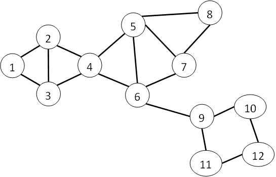

===========================
Machine Learning Algorithms
===========================

.. _ds_mlal_K-Clique Percolation Algorithm:

------------------------------------------------------------
Community Detection Using the K-Clique Percolation Algorithm
------------------------------------------------------------

Overview
========
Modeling data as a graph captures relations – friendship ties between social network users or chemical interactions between proteins.
Analyzing the community structure of the graph reveals collections of entities that are more likely to interact amongst each
other – for example, a community of friends in a social network or the “community” of highly interacting proteins of a cellular process.

The Intel Analytics Toolkit (IAT) version 0.8.x provides community detection using the k-Clique percolation method first proposed by
Palla et. al. [1]_ that has been widely used in many contexts.
Other community detection algorithms may be offered in future releases of the IAT.

K-Clique Percolation
====================
K-clique percolation is one of many different methods for detecting community structure in graphs.
Here we provide mathematical background on how communities are defined in the context of the k-clique percolation algorithm.

A k-clique is with :math:`k` vertices in which all :math:`\left( \frac {k}{2} \right)` possible edges are present.
A k-clique is certainly a community in the sense that its nodes are all connected , but, it is too restrictive for most purposes,
since it is natural that a few members of the community may not interact.
The k-clique percolation method forms communities by taking unions of k-cliques that overlap in :math:`k - 1` vertices.

Example:
--------
In the graph below, the 3-clique communities are {1,2,3, 4} and {4, 5, 6, 7, 8}. Note that the nodes 9, 10, 11, 12 belong to no community at all,
whereas 4 belongs to two distinct (but overlapping) communities.

Distributed Implementation of K-Clique Community Detection
==========================================================

The implementation of k-clique community detection in IAT is a fully distributed Apache Spark based implementation that follows the
map-reduce algorithm proposed in Varamesh et. al. [2]_ .

It has the following steps:

1.  A k-clique enumeration method is used to enumerate all k-cliques.
#.  k-cliques are used to build  a “clique graph” by declaring each k-clique to be a vertex in a new graph and placing edges between
    k-cliques that share k-1 vertices in the base graph.
#.  A :term:`connected component` analysis is performed on the clique graph.
    Connected components of the clique graph correspond to k-clique communities in the base graph.
#.  The connected components information for the clique graph is projected back down to the base graph,
    providing each vertex with the set of k-clique communities to which it belongs.

Usage:
    Syntax::

        graph.ml.kclique_percolation (
                                     cliqueSize, 
                                     communityPropertyDefaultLabel
                                     )

    Arguments:

        cliqueSize

            Parameter determining clique-size (the number :math:`k`) used to determine communities.
            Must be at least 1.
            Large values of cliqueSize result in fewer, smaller communities that are more connected.

        communityPropertyDefaultLabel

            name of the community property of vertex that will be updated/created in the input graph

The algorithm updates the input graph vertex with updated property named in “communityPropertyDefaultLabel”, mentioned in the argument list.

    Example::
    
        from intelanalytics import *
        dataset = r"datasets/kclique_edges.csv"
        schema= [("source", int64), ("target", int64)]
        csvfile = CsvFile(dataset, schema)
        f = BigFrame(csvfile)
        source = VertexRule("source", f.source)
        target = VertexRule("target", f.target)
        edge = EdgeRule("edge", target, source)
        g = BigGraph([target, source, edge], "mygraph")
        g.ml.kclique_percolation(cliqueSize = 3, communityPropertyDefaultLabel = "Community")

.. rubric:: Footnotes

.. [1] 
    G. Palla, I. Derenyi, I. Farkas, and T. Vicsek. “Uncovering the overlapping community structure of complex networks in nature and society”.
    Nature, 435:814, 2005 ( See http://hal.elte.hu/cfinder/wiki/papers/communitylettm.pdf )
    
.. [2]
    Varamesh, A.; Akbari, M.K.; Fereiduni, M.; Sharifian, S.; Bagheri, A.,
    "Distributed Clique Percolation based community detection on social networks using MapReduce,"
    Information and Knowledge Technology (IKT), 2013 5th Conference on , vol., no., pp.478,483, 28-30 May 2013
